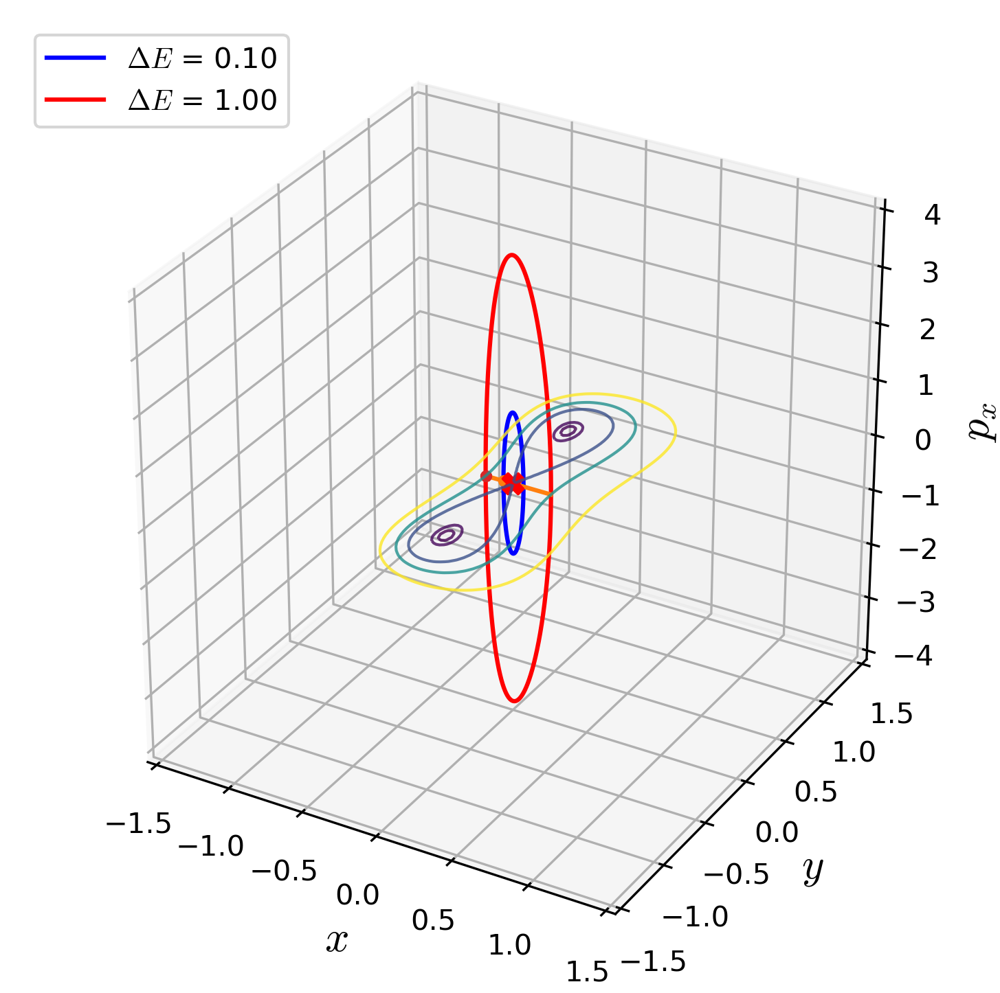
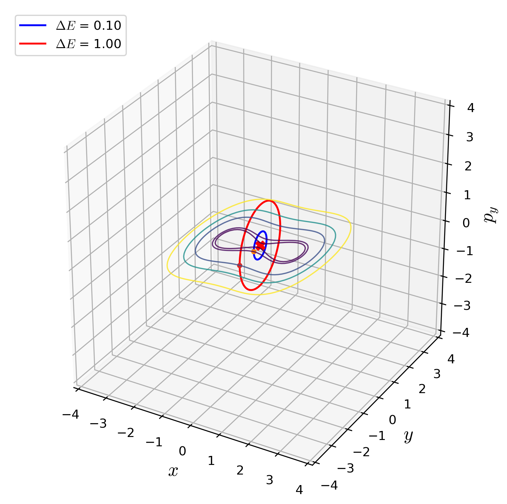

-   [Introduction](#introduction)
-   [Examples](#examples)
    -   [De Leon-Berne Hamiltonian](#dbham)
    -   [Coupled quartic Hamiltonian](#coupled-quartic-hamiltonian)
-   [References](#references)

Introduction
============

Computation of unstable periodic orbits in two degrees of freedom Hamiltonian systems arises in a diverse array of problems in physical sciences and engineering (Parker and Chua [1989](#ref-Parker_1989); Wiggins [2003](#ref-wiggins_introduction_2003)). The unstable periodic orbits exist in the bottleneck of the equipotential line *V*(*x*, *y*)=*E* and project as lines on the configuration space (*x*, *y*) for the Hamiltonian system of the form kinetic plus potential energy (Wiggins [2016](#ref-wiggins_role_2016)). The three methods are

-   Differential correction (Wang Sang Koon et al. [2000](#ref-koon_heteroclinic_2000); W. S. Koon et al. [2011](#ref-Koon2011); Naik and Ross [2017](#ref-naik_geometry_2017); Ross et al. [2018](#ref-ross_experimental_2018); Naik and Wiggins [2019](#ref-naik_finding_2019b))
-   Turning point (Pollak, Child, and Pechukas [1980](#ref-Pollak_1980); Nelson De Leon and Berne [1981](#ref-Deleon_Berne_1981))
-   Turning point based on configuration difference

implemented in this package has been used for transition dynamics in chemical reactions, celestial mechanics, and ship capsize. We have included Hamiltonian systems with two potential wells connected by a bottleneck where the unstable periodic orbits exist for energy above the energy of the saddle equilibrium point ([2003](#ref-wiggins_introduction_2003)).

Examples
========

In the sections below, we briefly describe the Hamiltonian systems that are used to demonstrate the methods mentioned in [Introduction](#introduction).

Consider the following two degrees-of-freedom Hamiltonian model where *x*, *y* are configuration space coordinates and *p**x*, *p**y* are corresponding momenta, *V*(*x*, *y*) is the potential energy, and *T*(*x*, *y*) is the kinetic energy.

De Leon-Berne Hamiltonian
-------------------------

This Hamiltonian has been studied as a model of isomerization of a single molecule that undergoes conformational change and exhibits regular and chaotic dynamics relevant for chemical reactions (Nelson De Leon and Berne [1981](#ref-Deleon_Berne_1981); N De Leon and Marston [1989](#ref-DeLeon_Marston_1989); Marston and De Leon [1989](#ref-marston_reactive_1989)).

Unstable periodic orbits at two values of the total energy for the De Leon-Berne Hamiltonian computed using differential correction method.

Coupled quartic Hamiltonian
---------------------------

This Hamiltonian models a chemical reaction where the *molecule* reacts by crossing the barrier separating the double-well (two molecular configurations which are denoted by the bottom of the well) potential and is coupled with the *solvent* represented by the harmonic oscillator.

Unstable periodic orbits at two values of the total energy for the coupled quartic Hamiltonian computed using differential correction method.

References
==========

De Leon, N, and C. Clay Marston. 1989. “Order in Chaos and the Dynamics and Kinetics of Unimolecular Conformational Isomerization.” *The Journal of Chemical Physics* 91 (6): 3405–25. doi:[10.1063/1.456915](https://doi.org/10.1063/1.456915).

De Leon, Nelson, and B. J. Berne. 1981. “Intramolecular Rate Process: Isomerization Dynamics and the Transition to Chaos.” *The Journal of Chemical Physics* 75 (7): 3495–3510. doi:[10.1063/1.442459](https://doi.org/10.1063/1.442459).

Koon, W. S., M. W. Lo, J. E. Marsden, and S. D. Ross. 2011. *Dynamical systems, the three-body problem and space mission design*. Marsden books.

Koon, Wang Sang, Martin W. Lo, Jerrold E. Marsden, and Shane D. Ross. 2000. “Heteroclinic Connections Between Periodic Orbits and Resonance Transitions in Celestial Mechanics.” *Chaos: An Interdisciplinary Journal of Nonlinear Science* 10 (2): 427–69.

Marston, C. Clay, and N. De Leon. 1989. “Reactive Islands as Essential Mediators of Unimolecular Conformational Isomerization: A Dynamical Study of 3‐phospholene.” *The Journal of Chemical Physics* 91 (6): 3392–3404. doi:[10.1063/1.456914](https://doi.org/10.1063/1.456914).

Naik, Shibabrat, and Shane D. Ross. 2017. “Geometry of Escaping Dynamics in Nonlinear Ship Motion.” *Communications in Nonlinear Science and Numerical Simulation* 47 (June): 48–70.

Naik, Shibabrat, and Stephen Wiggins. 2019. “Finding Normally Hyperbolic Invariant Manifolds in Two and Three Degrees of Freedom with Hénon-Heiles-Type Potential.” *Phys. Rev. E* 100 (2): 022204. doi:[10.1103/PhysRevE.100.022204](https://doi.org/10.1103/PhysRevE.100.022204).

Parker, T. S., and L. O. Chua. 1989. *Practical Numerical Algorithms for Chaotic Systems*. New York, NY, USA: Springer-Verlag New York, Inc.

Pollak, Eli, Mark S. Child, and Philip Pechukas. 1980. “Classical Transition State Theory: A Lower Bound to the Reaction Probability.” *The Journal of Chemical Physics* 72 (3): 1669–78. doi:[10.1063/1.439276](https://doi.org/10.1063/1.439276).

Ross, Shane D., Amir E. BozorgMagham, Shibabrat Naik, and Lawrence N. Virgin. 2018. “Experimental Validation of Phase Space Conduits of Transition Between Potential Wells.” *Phys. Rev. E* 98 (5): 052214.

Wiggins, Stephen. 2003. *Introduction to Applied Nonlinear Dynamical Systems and Chaos*. 2nd ed. Texts in Applied Mathematics 2. New York: Springer.

———. 2016. “The Role of Normally Hyperbolic Invariant Manifolds (NHIMs) in the Context of the Phase Space Setting for Chemical Reaction Dynamics.” *Regular and Chaotic Dynamics* 21 (6): 621–38. doi:[10.1134/S1560354716060034](https://doi.org/10.1134/S1560354716060034).
